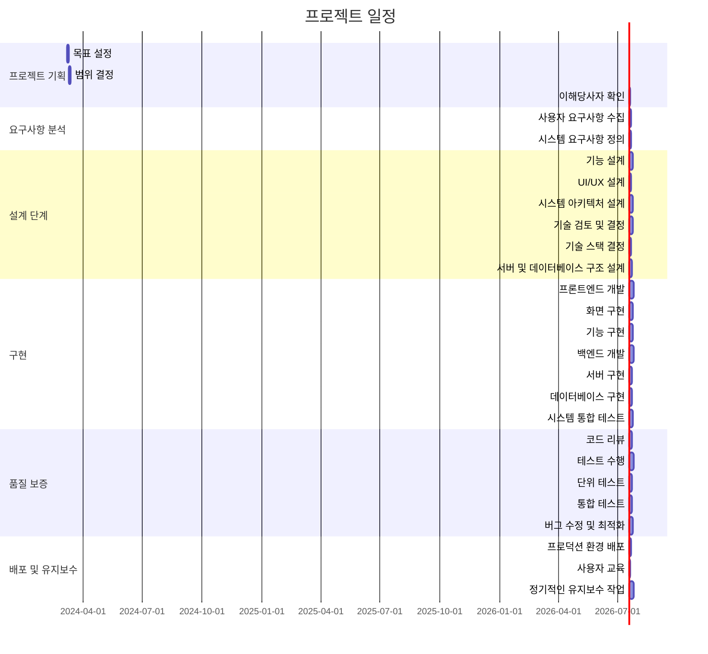

# blog
# ERD
# WBS

```mermaid
gantt
    title 프로젝트 일정

    section 프로젝트 기획
    목표 설정            :a1, 2024-03-08, 3d
    범위 결정            :after a1  , 2d
    이해당사자 확인      :after a2  , 2d

    section 요구사항 분석
    사용자 요구사항 수집 :after a3  , 3d
    시스템 요구사항 정의 :after a4  , 3d

    section 설계 단계
    기능 설계            :after a5  , 5d
    UI/UX 설계           :after a6  , 3d
    시스템 아키텍처 설계  :after a7  , 5d
    기술 검토 및 결정     :after a8  , 5d
    기술 스택 결정        :after a9  , 3d
    서버 및 데이터베이스 구조 설계 :after a10 , 4d

    section 구현
    프론트엔드 개발      :after a11 , 7d
    화면 구현            :after a12 , 5d
    기능 구현            :after a13 , 5d
    백엔드 개발          :after a14 , 7d
    서버 구현            :after a15 , 4d
    데이터베이스 구현    :after a16 , 4d
    시스템 통합 테스트   :after a17 , 5d

    section 품질 보증
    코드 리뷰            :after a18 , 4d
    테스트 수행          :after a19 , 7d
    단위 테스트          :after a20 , 4d
    통합 테스트          :after a21 , 4d
    버그 수정 및 최적화 :after a22 , 5d

    section 배포 및 유지보수
    프로덕션 환경 배포   :after a23 , 3d
    사용자 교육          :after a24 , 2d
    정기적인 유지보수 작업 :after a25 , 7d
```
