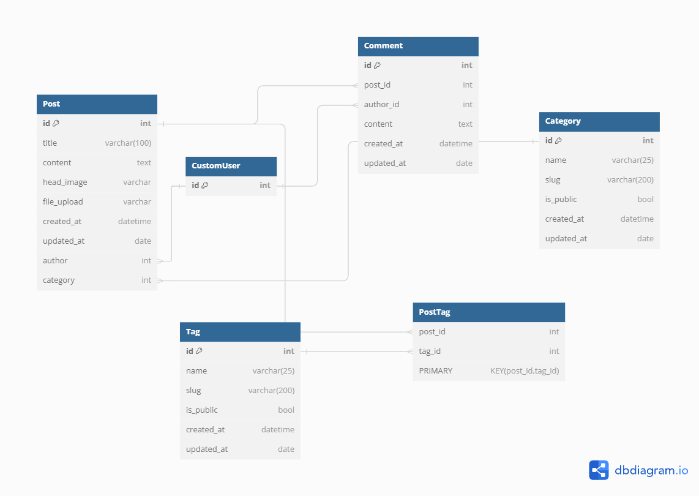
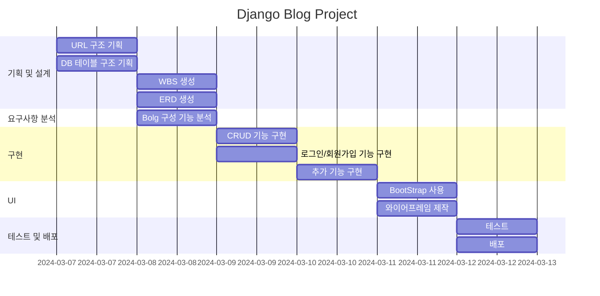
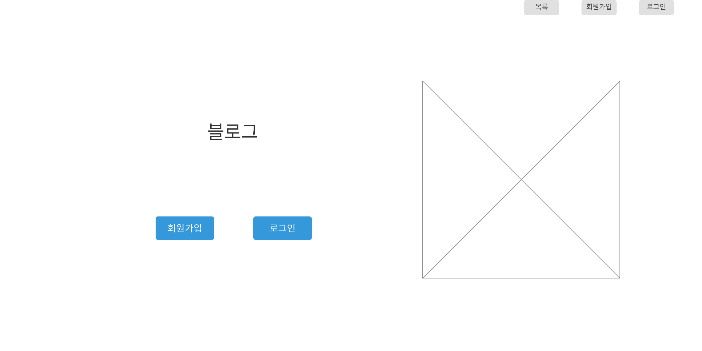
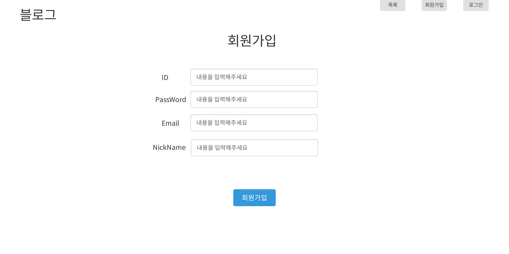
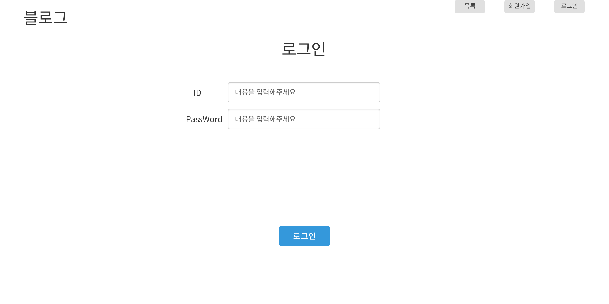
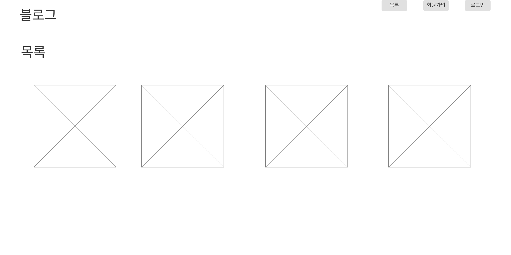
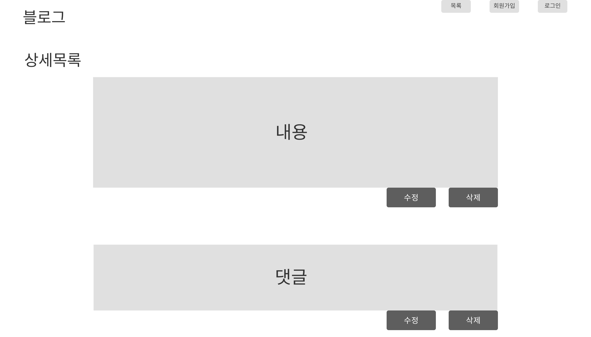
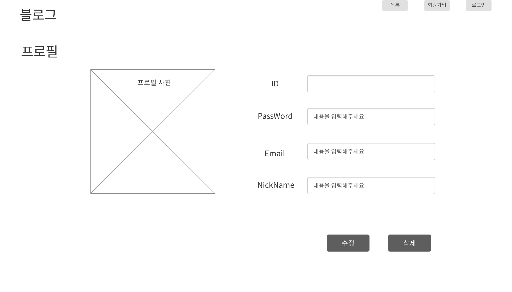

# 1. 목표와 기능
## 1.1 목표
* Django를 활용한 서비스 제작
* DB에 대한 이해
## 1.2 기능
* 메인페이지
* CRUD 구현
* 로그인 및 회원가입

# URL 구조

<table>
  <tr>
    <th>App Name</th>
    <th>Views Function</th>
    <th>HTML File</th>
    <th>Remarks</th>
  </tr>
  <tr>
    <td rowspan="3">main</td>
    <td>index</td>
    <td>index.html</td>
    <td>/</td>
  </tr>
  <tr>
    <td>about</td>
    <td>about.html</td>
    <td>/about/</td>
  </tr>
  <tr>
    <td>index</td>
    <td>index.html</td>
    <td>/contact/</td>
  </tr>
  <tr>
    <td rowspan="5">blog</td>
    <td>blog_list</td>
    <td>blog_list.html</td>
    <td>/blog/</td>
  </tr>
  <tr>
    <td>blog_details</td>
    <td>blog_details.html</td>
    <td>/blog/&lt;int:pk&gt;</td>
  </tr>
  <tr>
    <td>blog_write</td>
    <td>blog_write.html</td>
    <td>/blog/write/</td>
  </tr>
  <tr>
    <td>blog_edit</td>
    <td>blog_edit.html</td>
    <td>/blog/edit/&lt;int:pk&gt;/</td>
  </tr>
  <tr>
    <td>blog_delete</td>
    <td>blog_delete.html</td>
    <td>/blog/delete/&lt;int:pk&gt;/</td>
  </tr>
  <tr>
    <td rowspan="4">accounts</td>
    <td>login</td>
    <td>login.html</td>
    <td>/login/</td>
  </tr>
  <tr>
    <td>logout</td>
    <td></td>
    <td>/logout/</td>
  </tr>
  <tr>
    <td>signup</td>
    <td>signup.html</td>
    <td>/signup/</td>
  </tr>
  <tr>
    <td>profile</td>
    <td>profile.html</td>
    <td>/profile/</td>
  </tr>
</table>

# 폴더 트리
📦 accounts
  ┣ 📜admin.py
  ┣ 📜apps.py
  ┣ 📜forms.py
  ┣ 📜models.py
  ┣ 📜urls.py
  ┣ 📜views.py
  ┣ 📜tests.py
  ┗ 📜__init__.py

📦 blog
  ┣ 📜admin.py
  ┣ 📜apps.py
  ┣ 📜forms.py
  ┣ 📜models.py
  ┣ 📜tests.py
  ┣ 📜urls.py
  ┣ 📜views.py
  ┗ 📜__init__.py

📦 config
  ┣ 📜asgi.py
  ┣ 📜settings.py
  ┣ 📜urls.py
  ┣ 📜wsgi.py
  ┗ 📜__init__.py

📦 main
  ┣ 📜admin.py
  ┣ 📜apps.py
  ┣ 📜models.py
  ┣ 📜tests.py
  ┣ 📜urls.py
  ┣ 📜views.py
  ┗ 📜__init__.py

📦 templates
  ┣ 📂 accounts
  ┃   ┣ 📜login.html
  ┃   ┣ 📜profile.html
  ┃   ┗ 📜signup.html
  ┣ 📂 blog
  ┃   ┣ 📜post_detail.html
  ┃   ┣ 📜post_list.html
  ┃   ┣ 📜post_form.html
  ┃   ┣ 📜post_delete.html
  ┃   ┣ 📜comment_form.html
  ┃   ┗ 📜bloglist.html
  ┣ 📂 main
  ┃   ┣ 📜about.html
  ┃   ┣ 📜index.html
  ┃   ┗ 📜contact.html
  ┗ 📜base.html

# ERD

# WBS

# 와이어 프레임
<table>
    <tr>
        <th>메인 화면</th>
        <th>설명</th>
    </tr>
    <tr>
        <td width="70%">
            
        </td>
        <td>
            <ul>
                <li>회원 가입과 로그인 버튼 출력</li>
                <li>오른쪽 상단에 로그인과 목록 버튼 존재</li>
            </ul>
        </td>
    </tr>
</table>
<table>
    <table>
    <tr>
        <th>회원 가입</th>
        <th>설명</th>
    </tr>
    <tr>
        <td width="70%">
            
        </td>
        <td>
            <ul>
                <li>회원 가입 시 기입해야 할 정보 입력창 출력</li>
                <li>ID, PASSWORD, NICKNAME, EMAIL 창 존재</li>
            </ul>
        </td>
    </tr>
</table>
<table>
    <tr>
        <th>로그인</th>
        <th>설명</th>
    </tr>
    <tr width="70%">
        <td width="70%">
            
        </td>
        <td>
            <ul>
                <li>로그인이 가능한 입력창 출력</li>
            </ul>
        </td>
    </tr>
</table>
<table>
    <tr>
        <th>목록</th>
        <th>설명</th>
    </tr>
    <tr>
        <td width="70%">
            
        </td>
        <td>
            <ul>
                <li>생성된 게시물 목록 출력</li>
            </ul>
        </td>
    </tr>
</table>
<table>
    <tr>
        <th>목록</th>
        <th>설명</th>
    </tr>
    <tr>
        <td width="70%">
            
        </td>
        <td>
            <ul>
                <li>게시물의 상세한 내용 출력</li>
            </ul>
        </td>
    </tr>
</table>
<table>
    <tr>
        <th>목록</th>
        <th>설명</th>
    </tr>
    <tr>
        <td width="70%">
            
        </td>
        <td>
            <ul>
                <li>게시물의 상세한 내용 출력</li>
            </ul>
        </td>
    </tr>
</table><table>
    <tr>
        <th>프로필</th>
        <th>설명</th>
    </tr>
    <tr>
        <td width="70%">
            
        </td>
        <td>
            <ul>
                <li>회원의 가입 시 입력 정보 출력</li>
            </ul>
        </td>
    </tr>
</table>

# 트러블 슈팅
커스텀 유저를 만들어 사용할 때 
django.db.utils.IntegrityError: UNIQUE constraint failed: accounts_customuser.nickname
라는 nickname 필드에 대한 유니크 제약조건을 위반했다는 오류가 계속 발생

해결방법으로
1. 장고 모델에 있는 AbstractUser의 클래스에 아래 코드들을 추가.
2. CustomUser 필드에 email과 nickname을 회원가입 시에 기입하도록 변경

email = models.EmailField(_("email address"), blank=True, unique=True)
nickname = models.CharField(max_length=50, unique=True)

# 느낀점
ERD와 URL 구조를 먼저 정리하는 것의 중요성을 깨닫게 되었습니다. 코드를 작성하면서 구조를 형성하려고 했으나, 구조의 혼란으로 인해 오히려 시간을 낭비하게 되었습니다. 이러한 경험을 통해, 프로젝트를 시작하기 전에 명확한 데이터 모델과 URL 구조를 설계하는 것이 중요하다는 것을 깨닫게 되었습니다.

