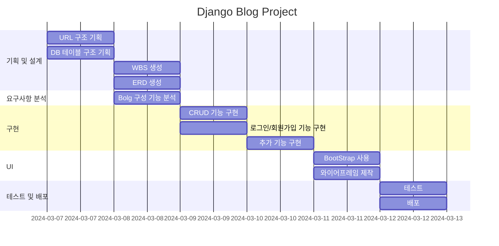

# blog
# ERD
Table User {
  UserID INT [PK]
  Name VARCHAR
  Email VARCHAR
  Password VARCHAR
  SignUpDate DATETIME
}

Table Post {
  PostID INT [PK]
  Title VARCHAR
  Content TEXT
  CreatedAt DATETIME
  UserID INT [ref: > User.UserID]
}

Table Comment {
  CommentID INT [PK]
  Content TEXT
  CreatedAt DATETIME
  UserID INT [ref: > User.UserID]
  PostID INT [ref: > Post.PostID]
}

Table Category {
  CatID INT [PK]
  Name VARCHAR
  Description VARCHAR
}

Table Tag {
  TagID INT [PK]
  Name VARCHAR
}

Table PostTag {
  PostID INT [ref: > Post.PostID]
  TagID INT [ref: > Tag.TagID]
  PRIMARY KEY(PostID, TagID)
}

# WBS

