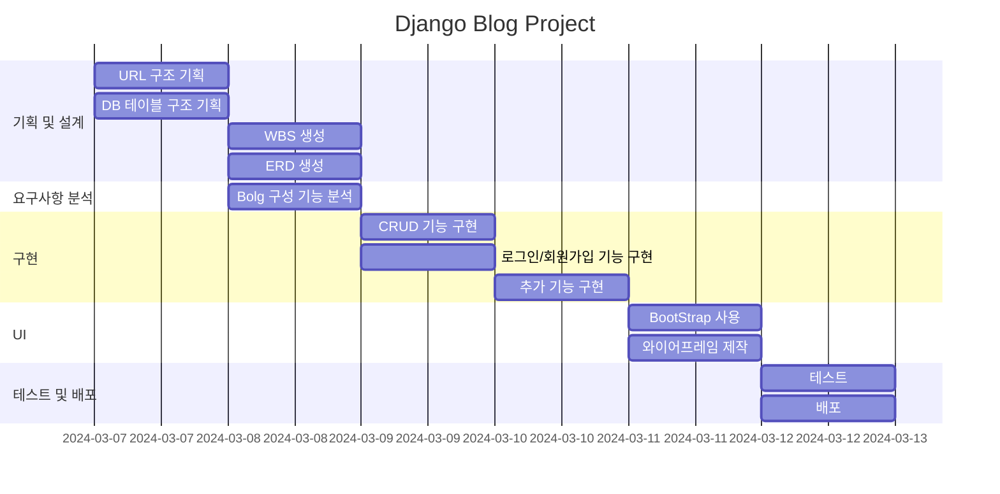

# 1. 목표와 기능
## 1.1 목표
* Django를 활용한 서비스 제작
* DB에 대한 이해
## 1.2 기능
* 메인페이지
* CRUD 구현
* 로그인 및 회원가입

# URL 구

# 폴더 트리

📦accounts
 ┣ 📜admin.py
 ┣ 📜apps.py
 ┣ 📜forms.py
 ┣ 📜models.py
 ┣ 📜urls.py
 ┣ 📜views.py
 ┣ 📜tests.py
 ┗ 📜__init__.py
 📦blog
 ┣ 📜admin.py
 ┣ 📜apps.py
 ┣ 📜forms.py
 ┣ 📜models.py
 ┣ 📜tests.py
 ┣ 📜urls.py
 ┣ 📜views.py
 ┗ 📜__init__.py
 📦config
 ┣ 📜asgi.py
 ┣ 📜settings.py
 ┣ 📜urls.py
 ┣ 📜wsgi.py
 ┗ 📜__init__.py
 📦main
 ┣ 📜admin.py
 ┣ 📜apps.py
 ┣ 📜models.py
 ┣ 📜tests.py
 ┣ 📜urls.py
 ┣ 📜views.py
 ┗ 📜__init__.py
📦templates
 ┣ 📂accounts
 ┃ ┣ 📜login.html
 ┃ ┣ 📜profile.html
 ┃ ┣ 📜signup.html
 ┣ 📂blog
 ┃ ┣ 📜post_detail.html
 ┃ ┣ 📜post_list.html
 ┃ ┣ 📜post_form.html
  ┃ ┣ 📜post_delete.html
 ┃ ┣ 📜comment_form.html
 ┃ ┗ 📜bloglist.html
 ┣ 📂main
 ┃ ┣ 📜about.html
 ┃ ┗ 📜index.html
 ┃ ┗ 📜contact.html
 ┗ 📜base.html

# ERD

# WBS

# 와이어 프레임
<table>
    <tr>
        <th>메인 화면</th>
        <th>설명</th>
    </tr>
    <tr>
        <td width="70%">
            
        </td>
        <td>
            <ul>
                <li>회원 가입과 로그인 버튼 출력</li>
                <li>오른쪽 상단에 로그인과 목록 버튼 존재</li>
            </ul>
        </td>
    </tr>
</table>
<table>
    <table>
    <tr>
        <th>회원 가입</th>
        <th>설명</th>
    </tr>
    <tr>
        <td width="70%">
            
        </td>
        <td>
            <ul>
                <li>회원 가입 시 기입해야 할 정보 입력창 출력</li>
                <li>ID, PASSWORD, NICKNAME, EMAIL 창 존재</li>
            </ul>
        </td>
    </tr>
</table>
<table>
    <tr>
        <th>로그인</th>
        <th>설명</th>
    </tr>
    <tr width="70%">
        <td width="70%">
            
        </td>
        <td>
            <ul>
                <li>로그인이 가능한 입력창 출력</li>
            </ul>
        </td>
    </tr>
</table>
<table>
    <tr>
        <th>목록</th>
        <th>설명</th>
    </tr>
    <tr>
        <td width="70%">
            
        </td>
        <td>
            <ul>
                <li>생성된 게시물 목록 출력</li>
            </ul>
        </td>
    </tr>
</table>
<table>
    <tr>
        <th>목록</th>
        <th>설명</th>
    </tr>
    <tr>
        <td width="70%">
            
        </td>
        <td>
            <ul>
                <li>게시물의 상세한 내용 출력</li>
            </ul>
        </td>
    </tr>
</table>
<table>
    <tr>
        <th>목록</th>
        <th>설명</th>
    </tr>
    <tr>
        <td width="70%">
            
        </td>
        <td>
            <ul>
                <li>게시물의 상세한 내용 출력</li>
            </ul>
        </td>
    </tr>
</table><table>
    <tr>
        <th>프로필</th>
        <th>설명</th>
    </tr>
    <tr>
        <td width="70%">
            
        </td>
        <td>
            <ul>
                <li>회원의 가입 시 입력 정보 출력</li>
            </ul>
        </td>
    </tr>
</table>
